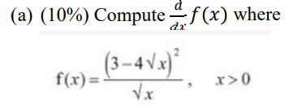
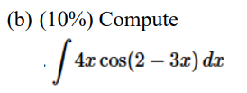

**INSTRUCTIONS**:

1. This is a closed-book test. Except for the question paper, you are NOT allowed to consult any online/offline material or resources.
2. You are not allowed to collaborate with others or to use any collaborative tools during the test.
3. Answer ALL questions.
4. Hand-write your answer on paper.
5. No calculator is allowed.

**Q1. (20%)** Write a program in C, C++, Python or Java that inputs an array of 2023 numbers with
distinct array entries chosen from the 2024 integers 0, 1, 2, …, 2022, 2023 and then prints the missing integer. For example, if the array stores the 2023 numbers 1, 2, 3, ..., 2022, 2023, then your program should print 0.

You may assume that the input has 2023 lines, each contains a distinct integer in {0, 1, 2,..., 2023}. Also, note that the mark will be determined by the correctness, efficiency, and memory usage of your program.

**Q2. (20%)** A perfect number is a positive integer that is equal to the sum of its positive
divisors, excluding the number itself. For example, 6 has divisors 1, 2, 3 and 6, and 1 + 2 + 3 = 6, so 6 is a perfect number. The first 4 perfect numbers are 6, 28, 496 and 8128.

Write a program in C, C++, Python or Java that inputs a positive integer k, and then prints the kth perfect number. For example, if the input of the program is 4, then the program
should print the line

<u>The 4th perfect number is 8128.</u>

However, if there is a perfect number that is odd and is no greater than the kth perfectnumber, your program should print instead the line

<u>We have found an odd perferct number.</u>

**Q3: (20%)** 
 

**Q4: (20%)** 
a. (10%) Assume that the probability a child is a boy is 0.6 and that the sexes of children born into a family are independent. What is the probability that a family of five children has
1. exactly three boys?
2. at least one girl?
3. all children of the same sex?

b. (10%) What is the probability that two people chosen at random were born on the 
same day of the week (e.g., both on Monday).

Q5:(20%) Given a dataset: {x1, x2, …, xn}, 
(a) (10%) Write down the definition for the standard deviation (标准差).
(b) (10%) Let p be the standard deviation of this dataset. Now, if each item is 
decreased by dividing a constant c, i.e. the dataset becomes {x1/c, x2/c, …, xn/c}, 
what is the new standard deviation? Or explain why it cannot be determined.
